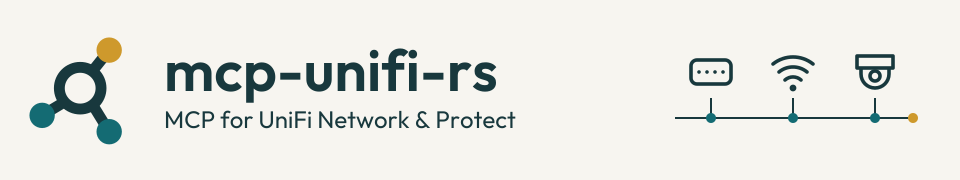

# mcp-unifi-rs

<picture>
  <source media="(max-width: 600px) and (prefers-color-scheme: dark)" srcset="docs/branding/assets/wordmark-dark.svg">
  <source media="(max-width: 600px)" srcset="docs/branding/assets/wordmark-light.svg">
  <source media="(prefers-color-scheme: dark)" srcset="docs/branding/assets/header-dark.svg">
  
</picture>

**Inspect your UniFi network and cameras, diagnose problems, and preview selected network changes from an MCP client.**

Connect an AI assistant to your UniFi console through this Rust server. MCP
(Model Context Protocol) lets the client use its operations as tools.
Controller credentials stay in the server, results are bounded, and network
changes preview before you confirm them.

**[Get started](#quickstart-stdio)** · **[Browse the docs](docs/README.md)** ·
**[Check compatibility](docs/compatibility.md)** · **[Get help](SUPPORT.md)**

## Things to try

- **Find a device and understand its connection.** Search connected clients by
  name, address, SSID, or VLAN, then inspect one client's access point, signal,
  and recent events with `clients.context`.
- **Investigate slow Wi-Fi.** Use `wifi.diagnose` to inspect radio load and
  weak-signal clients, then check a device or recent controller events.
- **Check Protect inventory.** Find cameras and inspect their reported state.
  An optional local account adds recording details, recorder health, and
  historical detections. These tools do not return video or snapshots.
- **Review a network change before applying it.** Preview a wireless-network
  update or a selected device action. Writes require an operator grant and
  explicit confirmation; previews do not change the controller.

The [tool reference](docs/tool-surface.md) covers inputs, permissions, result
limits, and what each action can verify. This is a curated interface to existing
configuration; it does not expose arbitrary controller API requests.

## Before you start

You need a UniFi OS console with the application's local Integration API and
an MCP client supporting protocol version 2026-07-28. Network needs its API key
and a dedicated local account. Protect needs its own API key; local-session
access is optional for additional details and historical events.

Each process serves **Network or Protect**. Run two processes to use both,
with separate client entries and application credentials. Check the
[compatibility guide](docs/compatibility.md) first: self-hosted Network is not
verified end to end, and controller MFA/SSO login is not implemented.

## Quickstart: stdio

Install Rust 1.96 and your platform's native build tools. CI validates Linux;
other host platforms are not tested here. For Docker or HTTP, follow the
[installation guide](docs/installation.md#http-and-containers).

```sh
git clone https://github.com/chrisbennight/mcp-unifi-rs.git
cd mcp-unifi-rs
cargo install --locked --path crates/unifi-server
cp .env.example .env
chmod 600 .env
```

Edit `.env` with your Network console origin (for example,
`https://console.example.net`), Integration API key, and local account
credentials. For Protect, copy `.env.protect.example` instead. If your console
uses a certificate your system does not trust, configure a
[custom CA or verified certificate pin](docs/configuration.md#tls-modes).

Load your trusted environment file and start your MCP client from that shell:

```sh
set -a
. ./.env
set +a
```

Add this stdio server to your client's configuration:

```json
{
  "mcpServers": {
    "unifi": {
      "command": "mcp-unifi-rs",
      "args": ["--transport", "stdio"]
    }
  }
}
```

The client must pass the controller environment to its child process. Desktop
clients may need an absolute binary path and their own protected environment
configuration. Do not put credentials in a configuration file you share.

List the tools, then call **`clients.search` with `{}`** for Network, or
**`cameras.search` with `{}`** for Protect. Expect a bounded inventory result.
An empty list means no matches; unsupported APIs and failed requests return
explicit errors. Neither call changes your controller.

Writes and secret disclosure are disabled in independent modes until the
operator grants them. See [permissions and troubleshooting](docs/transports.md).
Keep `--transport stdio` explicit: omitting it selects gateway mode.

## How it connects

Stdio lets a local MCP client launch the server. Direct Streamable HTTP uses a
separate bearer credential; remote access needs HTTPS termination. Optional
gateway mode verifies both a gateway bearer and a signed caller identity.
See [transport configuration](docs/transports.md) for each setup.

Network tools use the Integration API and local-session APIs. Protect uses its
Integration API, with optional local-session enrichment. The
[compatibility guide](docs/compatibility.md) maps capabilities to their sources
and explains firewall-generation limits.

## Go further

- [Installation](docs/installation.md): source setup, HTTP, and Docker Compose.
- [Configuration](docs/configuration.md): environment settings, TLS, and limits.
- [Tool reference](docs/tool-surface.md): available reads, previews, and actions.
- [Architecture](docs/architecture.md): crate responsibilities and request flow.
- [Distribution](docs/distribution.md): container tags, digests, inventories,
  upgrades, and rollback. The image target is Linux x86-64.

Published container: `ghcr.io/chrisbennight/mcp-unifi-rs`. Select a successful
build and pin its digest using the [distribution instructions](docs/distribution.md#verify-and-retain-a-deployment).
Package visibility and pull permissions are separate from repository visibility.

## Contributing

Follow [CONTRIBUTING.md](CONTRIBUTING.md) to build, test, and propose a change.
Tests use loopback fakes and require no controller or private infrastructure.
Useful reports include the application version, transport, tool call, and
redacted result. See [support](SUPPORT.md) and [private security reporting](SECURITY.md).

The [visual identity guide](docs/branding/README.md) covers artwork and writing.

## License

[MIT](LICENSE). The bundled artwork font has its own
[SIL Open Font License](docs/branding/fonts/OFL.txt).
This is an independent project, not an official Ubiquiti product.
