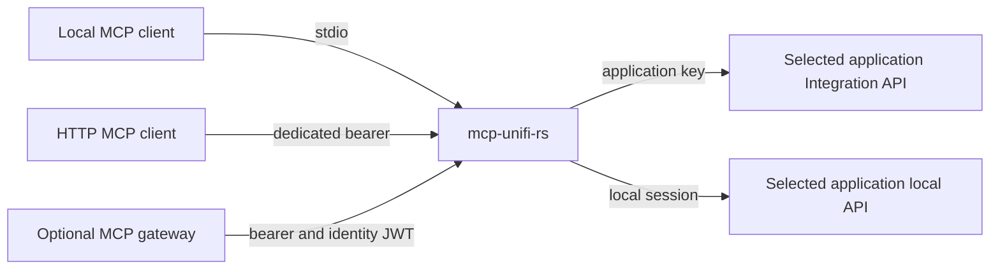

# Architecture

## System context

Independent clients connect over stdio or direct Streamable HTTP with fixed
operator-granted write and secret-disclosure permissions. See
[Connecting a client](transports.md).

In gateway mode, the gateway owns caller authentication, authorization groups (`mcp-admins`
full surface; `unifi` standard access), rate limiting, and tool-search
disclosure. This server owns the typed tool surface and the controller
transports.

One process serves one console family. `UNIFI_MCP_SURFACE` selects `network`
(the controller tools, gateway server name `unifi`) or `protect` (the camera
tools, gateway server name `unifi-protect`); each surface is a separate
deployment of the same image with its own credentials, identity JWT audience,
and gateway manifest, and neither process reads the other's configuration.
The local account is required for Network and optional for Protect enrichment.

## Crates

- **`unifi-api`** — bounded HTTP clients for both UniFi API generations,
  allowlisted response models, and per-controller capability detection
  (application version, and whether the firewall is zone-based). Consumers can
  always distinguish "unsupported on this console" from an empty result.
- **`unifi-mcp`** — everything model-visible: typed flat parameter structs
  rejecting unknown fields, normalized bounded responses, the executable tool
  registry with MCP annotations, dispatch, redaction, and the mutation
  safety pipeline (preview/confirm, read-back verification).
- **`unifi-server`** — environment configuration, gateway or direct bearer
  authentication, bounded stdio, the stateless Streamable HTTP mount, `/healthz`, the
  `--healthcheck` probe, and gateway manifest emission.

## Tool surface

Reads: `network.overview`, `clients.search`, `clients.context`,
`devices.search`, `devices.status`, `wifi.diagnose`, `firewall.read`,
`networks.read`, `events.search`, `stats.query`, `cameras.search`,
`cameras.status`, `protect.overview`, `protect.events`.

Mutations (preview-then-confirm; verified by read-back where the write
changes fields, by observation where it does not — see Write safety).
`wlans.update`, `clients.control` (block, unblock, reconnect),
`devices.control` (restart, locate, port cycle), `guests.authorize`,
`port_forwards.update` (enable, disable, rename), `firewall.policies.update`
(enable, disable; zone-based consoles), `vouchers.create` (mint hotspot
vouchers).

The device actions are one tool for the reason the client actions are: they
are one decision at one risk level about one device, and a curated surface
prefers a narrow typed action over three tools differing by a verb.

`port_forwards.update` changes whether a rule forwards and what it is called,
not where it points. Repointing a forward is a different rule with a different
blast radius, and the fields that express it — source, destination port,
internal host — only make sense validated together against the console's
address plan, which this server does not model.

### Why the firewall write resends the whole policy

Every other write here sends a partial update: a request naming `enabled`
changes `enabled` and leaves every other property alone.

The zone-based firewall has no equivalent. Its Integration API offers a `PATCH`
that accepts only the policy's logging flag — not the operation an operator
needs — and a `PUT` whose required body spans the policy's action, source,
destination, protocol scope, logging, name, and enabled state together.

So `firewall.policies.update` resends the policy exactly as it was just read,
altering only the switch. Nothing interprets the record in between, which is
the point: a write that sent back only what this server models would drop the
rest, on the object that decides what the network permits.

Each property travels as the bytes the controller sent. Parsing them into a
value model and serializing them again would be the same mistake in smaller
form — a number outside what `f64` distinguishes comes back changed — so the
parsed form exists only for the few properties this server reads, and is never
what is written.

Two consequences follow, and the tool states both rather than leaving them to
be discovered. It cannot merge, so an edit made elsewhere between the read and
the write is overwritten. And a confirmed call that would change nothing does
not write at all, because a resend that cannot move the switch is only a
chance to clobber.

Names, parameters, and response contracts are recorded in
`docs/tool-surface.md` as each tool lands.

## Write safety

A controller acknowledges writes whose fields it silently discards, so an
accepted write proves nothing. Every write tool shares one path:

- **Preview by default.** A call without `confirm` reaches no write endpoint
  and reports the fields that would move, with the consequences worth knowing
  first. A field already holding the requested value is not listed.
- **Read-back verification, for a write that changes fields.** After writing,
  the resource is re-read and each requested field reported as `persisted`,
  `dropped`, or `coerced`. Fields that moved without being requested are
  listed separately, compared over the controller's whole record rather than
  the modeled subset, so a write that clears an unmodeled property is visible.
  `verified` is true only when every requested field persisted and nothing
  else moved.
- **One identity across two APIs.** `guests.authorize` takes the hardware
  address the legacy client reads report and finds the Integration API client
  carrying the same address, because the authorization endpoint addresses a
  client by the Integration id and no read on this surface emits one. That a
  client has the same hardware address in both APIs is an assumption about
  the controller, not something either API states; it is the only place the
  two client identities are joined, and a mismatch surfaces as an address the
  controller does not know rather than as a wrong client being authorized.
- **Silence where there is nothing to observe.** Guest authorization changes
  no field the controller exposes, so the result says the effect cannot be
  read back rather than presenting an accepted request as a verified outcome.
  A tool that cannot check its own work says so.
- **Observation, for an action that changes no field.** Blocking or
  disconnecting a client changes nothing this server models, so there is
  nothing to classify and no `verified` flag to earn. Such a tool reports what
  the controller shows afterwards and what that is worth — a client that
  rejoins before the check reads as connected — rather than asserting the
  action succeeded. Claiming field-level verification where none exists would
  be the same false confidence the classification exists to prevent.
- **Redaction round trip.** A write carrying the `[redacted]` marker is
  refused before anything is interpreted, so a redacted read cannot overwrite
  the secret it stands for. The read side and the guard share one definition.
- **Secrets stay out of results.** A secret field reports its status and
  neither value. Configured credentials are scrubbed from the string values of
  every result, and a check that none survived covers the same string values
  and nothing else — reading property names instead would let a credential that
  spelled one withhold results forever. Substituting the marker can compose a
  string that matches a different configured secret, and such a match can run
  arbitrarily far into the surrounding text, so no number of further passes is
  the right number: a value the substitution cannot clear is replaced outright
  by the marker. That resolves in one step for any input and costs one field's
  text rather than the whole result. The one value that could survive its own
  replacement, being part of the marker, is refused at startup instead.
- **Stable selection.** A write addresses a resource by its controller id or
  hardware address, never by a renameable attribute. A client is addressed by
  MAC because a blocked one is absent from the connected list, so no name
  identifies it in every state the tool handles.
- **Self-sufficient requests.** Where a change is only safe in combination —
  turning encryption on needs a key — the caller states both and one request
  carries them. Reusing a value read earlier would make the outcome depend on
  that read still being current, which no read here is atomic with the write
  that follows it.

### The exception to read-back

`vouchers.create` cannot verify by reading back: a voucher's code is returned
once at creation and no read reproduces it, so a read-back would confirm that
vouchers exist while losing what they are.

It judges the batch on its own shape instead — count, identity, distinctness,
form — and reports those under a name that does not claim more than they
establish. The codes are returned whether the checks pass or fail, because the
vouchers exist either way and this response is their only copy. The single
exception is a code carrying a configured controller credential: disclosing one
is not a trade this surface makes, and it is the only loss here that recovers —
the voucher's id is returned so it can be revoked, and another call mints a
replacement.

Everything capable of refusing a batch does so before minting, since a batch
refused afterwards is credentials nobody can reach. That is also what bounds
the result: the batch ceiling is enforced on the request, and the response
budget does not apply, because there is nothing for a caller to narrow once the
vouchers exist. The same reasoning governs the rest of the path — a row without
an identity is reported rather than discarded while decoding, and the
credential scrub runs before the checks so a code it rewrote is reported as
unusable rather than handed back as though the controller issued it that way.
Nothing between the mint and the caller may alter or discard a code.

## Response bounds

Every bound on data a caller asked for is caller-pageable, fail-loud, or
explicitly signaled in the result; a silent subset is a defect (see the
security boundary in `AGENTS.md`). The table records each bound's contract
and why its value was chosen, so changing one is a one-line reviewed edit.

| Bound | Value | Applies to | Contract | Signal / recovery | Rationale |
|---|---|---|---|---|---|
| Search page limit | 1-200, default 50 | clients/devices/events search | caller-paged | `totalMatches`, `nextOffset` | one page stays well under the response budget |
| Search offset cap | 10 000 | same | fail-loud | error names the cap | deep offsets signal a wrong query, not paging |
| Filter length | 128 UTF-8 bytes | all string filters, and the voucher batch label | fail-loud | error; surrounding whitespace trimmed before the check, content never cut | longer values are ids pasted by mistake |
| Response budget | 48 KiB | every structured result except one carrying credentials the call created | fail-loud | "narrow the query" error; `vouchers.create` is exempt and bounded by its request instead — batch ceiling and label length, both checked before minting — since its codes exist nowhere else and there is nothing to narrow | keeps one result a fraction of a model context |
| Device inventory scan | 1000 rows | devices.*, AP name joins | signaled | `inventoryTruncated`; status selector error names the ceiling | order of magnitude above any home site |
| Firewall zone scan | 400 rows per call | firewall.read | signaled + continuable | `sectionsTruncated`; continue with `section: zones` and `sectionOffset` from `nextSectionOffset` | ceiling-limited section still fits the budget |
| Firewall policy scan | 200 rows per call | firewall.read | signaled + continuable | `sectionsTruncated`; continue with `section: policies` and `sectionOffset` from `nextSectionOffset` | full policy rows near the budget at this count |
| Section continuation offset | 100 000 | firewall.read | fail-loud | error names the cap; at the boundary the result carries `truncationNote` instead of an unusable offset | deeper offsets mean a query that should be narrowed instead |
| AP detail scan | 16 devices | wifi.diagnose | signaled | `accessPointsTruncated`; client-carrying devices scanned first | one upstream call per device makes this the fan-out bound of the whole surface. Devices inside the inventory scan are reachable through `devices.search` and `devices.status`; devices beyond that scan are reachable through neither, which the inventory bound's own signal reports |
| Rogue AP list | 100 rows | wifi.diagnose | signaled | `rogueApsTruncated` | dense neighborhoods exceed useful review length |
| Weak-client list | 50 rows | wifi.diagnose | declared top-N | "the 50 weakest, worst first" is the contract | diagnosis needs the worst cases, not a census |
| Port table | 128 rows | devices.status, per device | signaled | `portsTruncated` | largest real switches are 52 ports |
| Radio table | 16 rows | devices.status, wifi.diagnose | signaled | `radiosTruncated` | real access points carry 2-4 radios |
| Recent client events | 20 rows | clients.context | signaled | `recentEventsTruncated` when more matches were omitted | context summarizes the bounded site-wide scan |
| Client-event scan | 200 rows over 24 hours | clients.context | signaled | `recentEventsTruncated` when controller totals exceed the scan | one bounded system-log page balances freshness against fan-out |
| AP-name join | inherits device inventory scan | clients.search, clients.context | signaled | `apLookupTruncated`; wifi.diagnose folds it into `accessPointsTruncated` | a join can only be as complete as its scan |
| Event fetch window | 1000 system logs | events.search | signaled | `fetchWindowTruncated` when controller totals exceed the scan | narrow time or severity to reduce the upstream result |
| Protect event page | 1-200 rows plus one lookahead, default 50 | protect.events | caller-paged | `nextCursor` freezes the window and filters, then advances by a time key without splitting an equal-timestamp group; an oversized group fails loudly | each call stays within the response budget and never presents a bounded prefix as complete |
| Protect event window | at most 168 h per window, default latest 24 h | protect.events | caller-windowed | explicit `start`/`end` accept older adjacent windows; invalid spans fail before login | the undocumented route is bounded per request while all console-retained history remains addressable |
| Event message text | 256 chars | events.search, clients.context | marked | `…` appended only when cut | one line of context, never a silent excerpt |
| Overview event counts | two one-row queries over 24 hours | network.overview | controller totals | `recentEvents` gives the window, total, and HIGH/VERY_HIGH count | response totals avoid count saturation; the two reads are not atomic |
| Network event window | 1-168 h, default 24 | events.search | caller-chosen | validated, two-edged | keeps system-log queries bounded |
| WAN report window | 1-168 h, default 24 | stats.query | caller-chosen | validated | the upstream report rejects longer windows |
| Top applications | 1-50, default 10 | stats.query | caller-chosen | validated | ranking beyond 50 stops being "top" |
| Weak-signal floor | -100..-30 dBm, default -75 | wifi.diagnose | caller-chosen | validated | -75 dBm is the usual roaming threshold |
| Transport response | 4 MiB | every upstream read | fail-loud | bounded-read error | protects the process from a hostile upstream |
| Report window bound | 7 days | legacy hourly report | fail-loud | error before the request | keeps hourly rows bounded upstream |
| Client id resolution scan | 1000 rows | guests.authorize | fail-loud | a scan that ended at its ceiling says the address may exist beyond it, rather than reporting it unknown | the client reads address clients by hardware address while the authorization endpoint needs the controller's own id |
