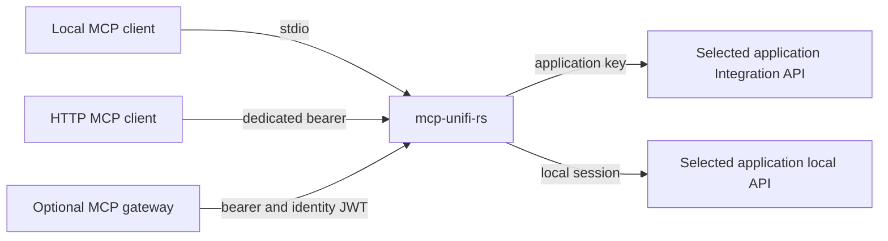

# Architecture

## System context

Independent clients connect over stdio or direct Streamable HTTP. Gateway
mode applies the gateway's caller policy. See
[Connecting a client](transports.md).

```mermaid
flowchart LR
    Local[Local MCP client] -->|stdio| Server[mcp-unifi-rs]
    Remote[HTTP MCP client] -->|dedicated bearer| Server
    Gateway[Optional MCP gateway] -->|bearer and identity JWT| Server
    Server -->|application key| Integration[Selected application Integration API]
    Server -->|local session| Application[Selected application local API]
```

In gateway mode, the gateway owns caller authentication, authorization groups (`mcp-admins`
full surface; `unifi` standard access), rate limiting, and tool-search
disclosure. This server owns the typed tool surface and the controller
transports.

One process serves one console family. `UNIFI_MCP_SURFACE` selects `network`
(the controller tools, gateway server name `unifi`) or `protect` (the camera
tools, gateway server name `unifi-protect`); each surface is a separate
deployment of the same image with its own credentials, identity JWT audience,
and gateway manifest, and neither process reads the other's configuration.
The local account is required for Network and optional for Protect enrichment.
Protect live updates use the official device and event subscriptions through
the same HTTP client's upgraded connection. This preserves its API key and
configured TLS roots or pins. Each call observes a finite window and reports
quiet windows, closure, failure, and count or byte limits separately.

## Crates

- **`unifi-api`** — bounded HTTP clients for both UniFi API generations,
  compact response models, complete source records, and per-controller
  capability detection
  (application version, and whether the firewall is zone-based). Consumers can
  always distinguish "unsupported on this console" from an empty result.
- **`unifi-mcp`** — everything model-visible: typed flat parameter structs
  rejecting unknown fields, normalized bounded responses, the executable tool
  registry with MCP annotations, dispatch, and mutation
  handling (preview/confirm, read-back verification).
- **`unifi-server`** — environment configuration, gateway or direct bearer
  authentication, bounded stdio, the stateless Streamable HTTP mount, `/healthz`, the
  `--healthcheck` probe, and gateway manifest emission.

## Tool surface

The executable `TOOL_REGISTRY` in `unifi-mcp` defines tool names, schemas,
annotations and classifications. [Tool contracts](tool-surface.md) describe the
workflows. Compact searches and diagnostics provide summaries; inventory,
policy and source reads provide complete selected controller records and
original metadata. Large fields remain available in labeled MCP content.

`networks.configure` creates, replaces, or deletes complete typed official
network configurations, including the controller's force deletion option.
`wifi.broadcasts.configure` provides the official Wi-Fi broadcast lifecycle,
including standard and IoT settings, enterprise RADIUS, multiple keys, and
the controller's force deletion option.

`port_forwards.list/status` expose full legacy records and envelope metadata.
`port_forwards.configure` provides typed creation, field updates, and deletion,
with complete accepted responses and bounded observation.

`wlans.list/status` expose complete legacy WLAN records, and
`wlans.groups.list` discovers their user, WLAN, and AP group references.
`wlans.configure` provides typed creation, field updates, and deletion,
including security, private keys, RADIUS, filtering, schedules, and radio
settings. It retains accepted responses and bounded controller observation.

Mutations preview by default and execute when the caller confirms. Typed
lifecycle tools group creation, update and deletion of related resources.
Action tools describe effects and return accepted responses plus bounded
readback or observation. The gateway decides who may call them.

`port_forwards.update` sends only the fields the caller names. A preview names
the requested changes, and a confirmed update reads the rule back to show
which values the controller kept.

### Why the firewall write resends the whole policy

Some writes send a partial update: a request naming `enabled` changes
`enabled` and leaves every other property alone. Other official Network
resources use complete replacement bodies.

The zone-based firewall Integration API supports a logging-only `PATCH` and
requires a complete policy for `PUT`. `firewall.policies.update` uses `PATCH`
for logging-only changes and resends the original policy for evaluation changes,
changing only requested flags. `firewall.policies.configure` provides full
creation and replacement through the published typed policy contract.

Each property travels as the bytes the controller sent. Complete response
values preserve numeric precision, but parsing and serializing can still change
whitespace and other JSON formatting. This write path retains the original
property text; parsed values are used only to inspect the properties it changes.

Two consequences follow, and the tool states both rather than leaving them to
be discovered. It cannot merge, so an edit made elsewhere between the read and
the write is overwritten. And a confirmed call that would change nothing does
not write at all, because no upstream change is needed.

Names, parameters, and response contracts are recorded in
`docs/tool-surface.md` as each tool lands.

## Write safety

Controllers can acknowledge writes whose fields they discard. Acceptance and
observed persistence are reported separately. Mutation workflows use these
contracts:

- **Preview by default.** A call without `confirm` reaches no write endpoint
  and reports the fields that would move, with the consequences worth knowing
  first. A field already holding the requested value is not listed.
- **Read-back verification.** Field update tools re-read the resource and
  classify requested fields as `persisted`, `dropped`, or `coerced`. Their
  complete-record comparison also identifies unrequested changes. Lifecycle
  tools compare the requested configuration and resource identity, or observe
  absence after deletion. Their results retain accepted responses and readback
  records or errors, so callers can distinguish acceptance from persistence.
- **Guest identity and readback.** Guest workflows take a hardware address and
  resolve the controller's Integration API client ID. They retain accepted
  authorization responses and read back the client access state and limits.
  A missing or mismatched identity, failed read or incomplete observation is
  reported without claiming verification. Complete client inventory readers
  also expose Integration API IDs.
- **Observation, for an action that changes no field.** Blocking or
  disconnecting a client changes nothing this server models, so there is
  nothing to classify and no `verified` flag to earn. Such a tool reports what
  the controller shows afterwards and what that is worth — a client that
  rejoins before the check reads as connected — rather than asserting the
  action succeeded. Claiming field-level verification where none exists would
  be the same false confidence the classification exists to prevent.
- **Response fidelity.** Selected controller values and complete accepted
  controller error bodies reach the caller faithfully. The
  gateway controls caller access. A non-UTF-8 error body is labeled and encoded
  as base64 so its original bytes can be recovered.
- **Stable selection.** A write addresses a resource by its controller id or
  hardware address, never by a renameable attribute. A client is addressed by
  MAC because a blocked one is absent from the connected list, so no name
  identifies it in every state the tool handles.
- **Partial wireless updates.** An omitted passphrase is not sent. The
  controller can retain an existing key or reject a security mode that lacks
  one; the read-back reports which fields persisted instead of guessing from
  the acknowledgement.

### Voucher readback

The official voucher list and detail endpoints return codes. `vouchers.create`
reports the returned batch's count, identity, distinctness and code lengths, then
reads each identified voucher back to compare its id and code. A failed
readback is reported alongside the creation response. `vouchers.search` and
`vouchers.status` let callers retrieve codes later without minting again.

The creation response preserves rows even when a batch check fails. Input
bounds are checked before minting. Complete accepted creation responses
remain available, including unusually large records. Voucher reads also
recover codes in caller-selected pages.

## Response bounds

Every bound on data a caller asked for is caller-pageable, fail-loud, or
explicitly signaled in the result; a silent subset is a defect (see the
security boundary in `AGENTS.md`). The table records observable bounds and
recovery paths. Resource bounds do not establish upstream retention or
capability limits.

| Bound | Value | Applies to | Contract | Signal / recovery | Rationale |
|---|---|---|---|---|---|
| Search page limit | 1-200, default 50 | clients/devices/events search | caller-paged | `totalMatches`, `nextOffset` | one page stays well under the response budget |
| Search filter length | 128 UTF-8 bytes | compact search filters | fail-loud | input error; surrounding whitespace normalized | bounds local matching work; complete inventory reads have their own typed filters |
| Voucher creation request | native API field ranges; complete serialized body at most 1 MiB | vouchers.create | fail-loud before controller access | error names the invalid native field or request bound | labels are forwarded unchanged; count and bandwidth fields match the upstream contract |
| Structured content formatting target | 48 KiB | formatters that move large fields to labeled MCP content | complete values preserved | `...InContent` flags locate moved fields; structured results may exceed the target | avoids repeating large values in structured and text content |
| Device inventory scan | 1000 rows | compact device searches and AP name joins | signaled | `inventoryTruncated`; complete inventory reads remain caller-pageable | bounds diagnostic scans and joining work |
| Firewall zone scan | 400 rows per call | firewall.read | signaled + continuable | `sectionsTruncated`; continue with `section: zones` and `sectionOffset` from `nextSectionOffset` | ceiling-limited section still fits the budget |
| Firewall policy scan | 200 rows per call | firewall.read | signaled + continuable | `sectionsTruncated`; continue with `section: policies` and `sectionOffset` from `nextSectionOffset` | full policy rows near the budget at this count |
| AP detail scan | 16 devices | wifi.diagnose | signaled | `accessPointsTruncated`; client-carrying devices scanned first | one upstream call per device makes this the fan-out bound of the whole surface. Complete adopted-device inventory pages remain available through `network.inventory.list` |
| Rogue AP list | 100 rows | wifi.diagnose | signaled | `rogueApsTruncated`; `network.source.read` pages complete neighboring AP records | bounds diagnostic output; omissions are explicitly signaled |
| Weak-client list | 50 rows | wifi.diagnose | declared top-N | "the 50 weakest, worst first" is the contract | diagnosis needs the worst cases, not a census |
| Port table | 128 rows | devices.status, per device | signaled | `portsTruncated` | bounds the compact status table; complete device statistics remain available |
| Radio table | 16 rows | devices.status, wifi.diagnose | signaled | `radiosTruncated` | bounds the compact diagnostic table; complete source records remain available |
| Recent client events | 20 rows | clients.context | signaled | `recentEventsTruncated` when more matches were omitted | context summarizes the bounded site-wide scan |
| Client-event scan | 200 rows over 24 hours | clients.context | signaled | `recentEventsTruncated` when controller totals exceed the scan | one bounded system-log page balances freshness against fan-out |
| AP-name join | inherits device inventory scan | clients.search, clients.context | signaled | `apLookupTruncated`; wifi.diagnose folds it into `accessPointsTruncated` | a join can only be as complete as its scan |
| Event fetch window | 1000 system logs | events.search | signaled | `fetchWindowTruncated`; `events.read` pages complete source records | bounds compact search work |
| Protect event page | 1-200 rows plus one lookahead, default 50 | protect.events | caller-paged | `nextCursor` freezes the window and filters, then advances by a time key without splitting an equal-timestamp group; an oversized group fails loudly | each call stays within the response budget and never presents a bounded prefix as complete |
| Protect event window | positive relative hours or ordered fixed bounds, default latest 24 h | protect.events | caller-windowed | invalid bounds fail before login; controller responses determine retained history | row and transport bounds limit each call |
| Event message text | 256 chars | events.search, clients.context | marked | `…` appended only when cut | one line of context, never a silent excerpt |
| Overview event counts | two one-row queries over 24 hours | network.overview | controller totals | `recentEvents` gives the window, total, and HIGH/VERY_HIGH count | response totals avoid count saturation; the two reads are not atomic |
| Network event window | positive hours, default 24 | events.search | caller-chosen | ordered bounds; events.read provides complete controller pages | page and transport bounds limit each call |
| WAN report window | positive hours or ordered hourly bounds, default 24 h | stats.query, traffic.read | caller-chosen | controller responses determine supported history | transport bounds limit each response |
| Top applications | 1-50, default 10 | stats.query | caller-chosen | validated; `traffic.read` and `network.source.read` provide complete Activity and DPI source records | bounds ranking output |
| Weak-signal floor | -100..-30 dBm, default -75 | wifi.diagnose | caller-chosen | validated | -75 dBm is the usual roaming threshold |
| Transport response | 4 MiB | every upstream read | fail-loud | bounded-read error | protects the process from a hostile upstream |
| Client id resolution scan | 1000 rows | guests.authorize | fail-loud | a scan that ended at its ceiling says the address may exist beyond it, rather than reporting it unknown | the client reads address clients by hardware address while the authorization endpoint needs the controller's own id |
