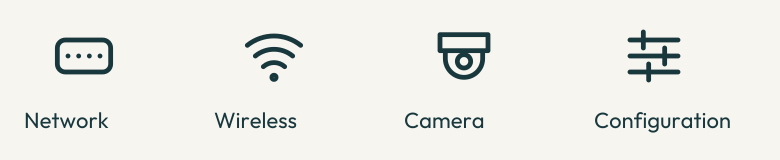

# Visual identity and writing

The project name is **mcp-unifi-rs**. Its identity uses a three-branch network
junction, warm ivory, teal, and a small ochre accent. Rounded linework connects
network, wireless, and camera illustrations. It should feel clear and
approachable beside Waygate and mcp-ssh-rs, with its own recognizable mark.

This guide governs presentation. The [architecture](../architecture.md),
[transports](../transports.md), and [tool reference](../tool-surface.md) describe
what the server does and permits.

## Approved direction

The maintainer selected **01 / Warm connections** on 2026-09-23. The
[approved concept](reference/approved-concept.png) was generated with OpenAI's
built-in image generation tool; its [prompts](reference/prompts.json) are retained.
It records the direction, not exact geometry,
typography, color values, or an application screenshot. The editable sources
and this guide define the maintained identity. Do not regenerate the mark for
each placement.

Production artwork uses simple geometry in [symbol.svg](symbol.svg) and
[features.svg](features.svg). The device illustration is introductory artwork,
not an architecture diagram or a claim about how a particular network is wired.

## Color and typography

| Role | Light appearance | Dark appearance |
| --- | --- | --- |
| Background | Ivory `#f7f5f0` | Deep teal `#18383d` |
| Text and main strokes | Deep teal `#18383d` | Ivory `#f7f5f0` |
| Connection endpoints | Teal `#146b73` | Pale teal `#7ac2c6` |
| Small decorative accent | Ochre `#ce992c` | Pale ochre `#e1b451` |

Ochre is decorative, not body text or a warning state. Brand colors do not
communicate success, authorization, or failure. Use explicit words for those
meanings. Keep ordinary text at a contrast ratio of at least 4.5:1; essential
graphical information needs 3:1 against its background. Check actual use after
changes, including both themes and small sizes.

Artwork uses **Outfit**, weight 600 for the name and 400 for the descriptor.
The exporter outlines lettering so images need no installed fonts or external
font service. Documentation retains the reader's GitHub or Markdown-renderer
fonts. Commands, paths, and identifiers use ordinary code formatting. Never put
installation instructions into an image.

Use flat surfaces, rounded stroke ends, and generous spacing. Avoid glow,
textures, exaggerated shadows, and decorative backgrounds behind text. Do not
copy the Ubiquiti mark or imply official endorsement.

## Placement and accessibility

Use one shallow header near the description. On narrow screens, show the
compact wordmark. Keep purpose, next action, and prerequisites in ordinary
text immediately below it. Avoid badge walls and decoration between setup steps.

Keep at least one endpoint diameter of clear space around the symbol. Scale it
proportionally and preserve its geometry. The avatar includes margins for
circular cropping. The monochrome export uses one ink for every component.

Give informative images useful alternative text. Images beside equivalent text
can use empty alternative text. Label unfamiliar icons and do not rely on color
alone. Check narrow headers, avatar crops, and small symbols. This server has no
browser dashboard to theme. Capture real supported behavior with synthetic data
if a screenshot is needed; generated art is not evidence of a running product.



## Assets and reproduction

| Asset | Use |
| --- | --- |
| `symbol-light.svg`, `symbol-dark.svg`, `symbol-mono.svg` | Transparent mark for the corresponding background, or a single ink |
| `wordmark-light.svg`, `wordmark-dark.svg` | Compact name and mark, including mobile headers |
| `header-light.svg`, `header-dark.svg` | Shallow README header with device artwork |
| `avatar-light.svg`, `avatar-dark.svg` and matching PNGs | Square identity with crop margins |
| `network.svg`, `wireless.svg`, `camera.svg`, `configuration.svg` | Feature icons using `currentColor` when embedded inline |
| `feature-icons.svg` | Labeled illustration sheet |
| `social-preview.svg`, `social-preview.png` | SVG export and opaque 1280 × 640 shared-link artwork |

Sources live beside this guide; generated files live in [assets](assets).
Use Python 3.11 or newer and an isolated environment from the repository root:

```sh
python3 -m venv /tmp/mcp-unifi-branding
/tmp/mcp-unifi-branding/bin/pip install -r docs/branding/requirements.txt
/tmp/mcp-unifi-branding/bin/python docs/branding/export.py
/tmp/mcp-unifi-branding/bin/python docs/branding/export.py --check
```

FontTools converts the local font to paths; resvg-py renders PNGs without system
fonts. Both are export-only tools, not server dependencies. Commit sources and
exports together. The check compares bytes but does not replace visual review
of headers, small icons, both appearances, and the social preview.

GitHub's social preview is a separate repository setting. Upload
[social-preview.png](assets/social-preview.png) under **Settings → Social
preview**, then verify a shared repository link. Committing it does not update
that setting. GitHub recommends 1280 × 640 and requires a file under 1 MB;
see its [social preview guidance](https://docs.github.com/en/repositories/managing-your-repositorys-settings-and-features/customizing-your-repository/customizing-your-repositorys-social-media-preview).

## Writing for someone new to the project

Lead with what a person can do, then show a complete first task and how to
recognize its result. State prerequisites before commands. Link to detailed
reference material when the reader needs a decision or a setting. A README
introduces the project; it need not duplicate every tool schema or build check.

Use ordinary sentences and concrete examples. Explain MCP on first use, and
keep API names exact. Avoid slogans, inflated claims, repeated introductions,
and words such as “seamless” or “effortless.” Do not describe an unverified
platform or controller release as supported. State limitations where they
affect the next step and distinguish observed outcomes from assumptions.

These choices follow [GitHub's README guidance](https://docs.github.com/en/repositories/managing-your-repositorys-settings-and-features/customizing-your-repository/about-readmes),
[Open Source Guides](https://opensource.guide/starting-a-project/), and
[Google's voice and tone guidance](https://developers.google.com/style/tone).
[Waygate's design language](https://github.com/chrisbennight/waygate/blob/main/docs/design.md)
and [mcp-ssh-rs's visual identity](https://github.com/chrisbennight/mcp-ssh-rs/blob/main/docs/branding/README.md)
provided examples of compact identity, theme variants, and maintained sources.

## Licensing and provenance

Original vector artwork and the exporter use the repository's [MIT license](../../LICENSE).
The unmodified [Outfit font](fonts/Outfit.ttf) retains its copyright notice and
[SIL Open Font License](fonts/OFL.txt). Its upstream source is
[Google Fonts' Outfit directory](https://github.com/google/fonts/tree/main/ofl/outfit),
with font project sources at [Outfitio](https://github.com/Outfitio/Outfit-Fonts).
The bundled font's SHA-256 is
`fc7287273e66929776e2ba54f144fe699080bec29f61bf649d70d871468aeade`.
The font is used for artwork exports only; the server does not install or
download it. Generated concept art is retained as a design reference.
